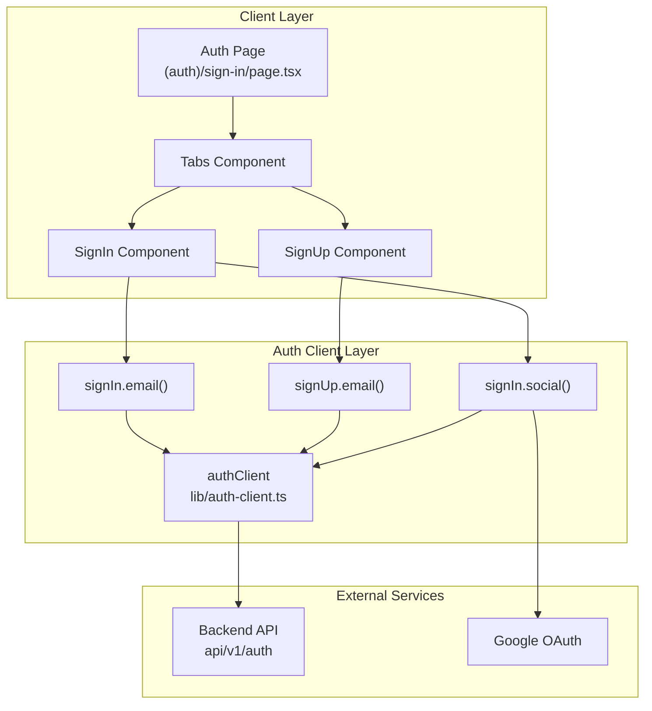

# Design Document: Authentication

## Overview

Implementasi halaman autentikasi untuk Kivo Web menggunakan Better Auth library. Fitur ini menyediakan dua metode autentikasi:

1. Email/Password authentication (sign-in dan sign-up)
2. OAuth authentication dengan Google

Halaman autentikasi akan menggunakan route group `(auth)` di Next.js App Router dengan komponen yang modular dan reusable.

## Architecture



## Components and Interfaces

### Page Structure

```
app/
├── (auth)/
│   ├── layout.tsx          # Auth layout (centered, minimal)
│   └── sign-in/
│       └── page.tsx        # Main auth page with tabs
features/
└── auth/
    ├── components/
    │   ├── sign-in-form.tsx
    │   ├── sign-up-form.tsx
    │   ├── oauth-buttons.tsx
    │   └── auth-tabs.tsx
    ├── hooks/
    │   └── use-auth.ts
    ├── types.ts
    └── index.ts
```

### Component Interfaces

```typescript
// features/auth/types.ts
export interface SignInFormData {
  email: string;
  password: string;
  rememberMe: boolean;
}

export interface SignUpFormData {
  firstName: string;
  lastName: string;
  email: string;
  password: string;
  passwordConfirmation: string;
}

export interface AuthTabsProps {
  defaultTab?: 'sign-in' | 'sign-up';
}

export interface OAuthProvider {
  id: 'google';
  name: string;
  icon: React.ReactNode;
}

// Profile image akan menggunakan DiceBear API sebagai default
// URL: https://api.dicebear.com/9.x/open-peeps/svg?seed={userName}
```

### UI Components Required

| Component | Source                                         | Purpose                        |
| --------- | ---------------------------------------------- | ------------------------------ |
| Button    | `features/shared/components/ui/button`         | Form submission, OAuth buttons |
| Input     | New - `features/shared/components/ui/input`    | Form fields                    |
| Label     | New - `features/shared/components/ui/label`    | Form labels                    |
| Card      | New - `features/shared/components/ui/card`     | Form container                 |
| Tabs      | New - `features/shared/components/ui/tabs`     | Switch between sign-in/sign-up |
| Checkbox  | New - `features/shared/components/ui/checkbox` | Remember me option             |

## Data Models

### Form State Management

```typescript
// Sign In State
interface SignInState {
  email: string;
  password: string;
  rememberMe: boolean;
  isLoading: boolean;
  error: string | null;
}

// Sign Up State
interface SignUpState {
  firstName: string;
  lastName: string;
  email: string;
  password: string;
  passwordConfirmation: string;
  isLoading: boolean;
  error: string | null;
}

// Profile image akan di-generate otomatis menggunakan DiceBear
// generateProfileImage(name: string): string =>
//   `https://api.dicebear.com/9.x/open-peeps/svg?seed=${encodeURIComponent(name)}`
```

### Auth Client Methods

```typescript
// From better-auth/react
import { authClient } from '@/lib/auth-client';

// Email Sign In
authClient.signIn.email({
  email: string,
  password: string,
  rememberMe?: boolean,
}, {
  onSuccess: (context) => void,
  onError: (context) => void,
});

// Email Sign Up
authClient.signUp.email({
  email: string,
  password: string,
  name: string,
  image: string, // DiceBear URL: https://api.dicebear.com/9.x/open-peeps/svg?seed={name}
  callbackURL?: string,
}, {
  onSuccess: (context) => void,
  onError: (context) => void,
});

// OAuth Sign In
authClient.signIn.social({
  provider: 'google',
  callbackURL?: string,
});
```

## Correctness Properties

_A property is a characteristic or behavior that should hold true across all valid executions of a system-essentially, a formal statement about what the system should do. Properties serve as the bridge between human-readable specifications and machine-verifiable correctness guarantees._

### Property 1: Loading State Disables Interaction

_For any_ authentication form (sign-in or sign-up), when the form is in loading state, the submit button SHALL be disabled and display a loading indicator.

**Validates: Requirements 1.4, 2.4, 5.3**

### Property 2: Password Confirmation Validation

_For any_ two strings where password !== passwordConfirmation, the sign-up form validation SHALL reject the submission and display an error message.

**Validates: Requirements 2.2**

### Property 3: Sign In Parameters Correctness

_For any_ valid sign-in form submission with email, password, and rememberMe values, the signIn.email function SHALL be called with those exact parameter values.

**Validates: Requirements 1.1, 1.3**

### Property 4: Sign Up Parameters Correctness

_For any_ valid sign-up form submission with firstName, lastName, email, and password, the signUp.email function SHALL be called with name as concatenation of firstName and lastName, and the provided email and password.

**Validates: Requirements 2.1**

### Property 5: DiceBear Profile Image URL Generation

_For any_ valid user name string, the generated DiceBear URL SHALL be a valid URL containing the encoded name as seed parameter.

**Validates: Requirements 2.1**

## Error Handling

### Client-Side Validation Errors

| Error Type           | Handling                              |
| -------------------- | ------------------------------------- |
| Empty email          | Prevent submission, show inline error |
| Invalid email format | Prevent submission, show inline error |
| Empty password       | Prevent submission, show inline error |
| Password mismatch    | Prevent submission, show inline error |
| Empty name fields    | Prevent submission, show inline error |

### Server-Side Errors

| Error Type           | Handling                                     |
| -------------------- | -------------------------------------------- |
| Invalid credentials  | Display error toast with message from server |
| Email already exists | Display error toast with message from server |
| OAuth failure        | Display error toast with failure reason      |
| Network error        | Display generic error toast                  |

### Toast Notification Pattern

```typescript
import toast from 'react-hot-toast';

// Success
toast.success('Successfully signed in');

// Error
toast.error(error.message || 'An error occurred');
```

## Testing Strategy

### Testing Framework

- **Unit Testing**: Vitest with React Testing Library
- **Property-Based Testing**: fast-check (already installed in project)

### Unit Tests

Unit tests akan mencakup:

- Form rendering dengan semua field yang diperlukan
- Tab switching behavior
- Link navigation (forgot password)
- OAuth button click handlers
- Toast notification triggers

### Property-Based Tests

Property-based tests menggunakan fast-check untuk memverifikasi:

1. **Loading State Property**: Generate random loading states dan verify button disabled state matches
2. **Password Validation Property**: Generate random string pairs dan verify validation logic
3. **Sign In Parameters Property**: Generate random valid credentials dan verify function calls
4. **Sign Up Parameters Property**: Generate random valid registration data dan verify function calls
5. **DiceBear URL Property**: Generate random name strings dan verify URL generation correctness

### Test File Structure

```
features/auth/
├── components/
│   └── __tests__/
│       ├── sign-in-form.test.tsx
│       ├── sign-up-form.test.tsx
│       └── auth-tabs.test.tsx
└── utils/
    └── __tests__/
        └── profile-utils.test.ts
```

### Test Annotations

Setiap property-based test HARUS di-annotate dengan format:

```typescript
// **Feature: authentication, Property {number}: {property_text}**
```
