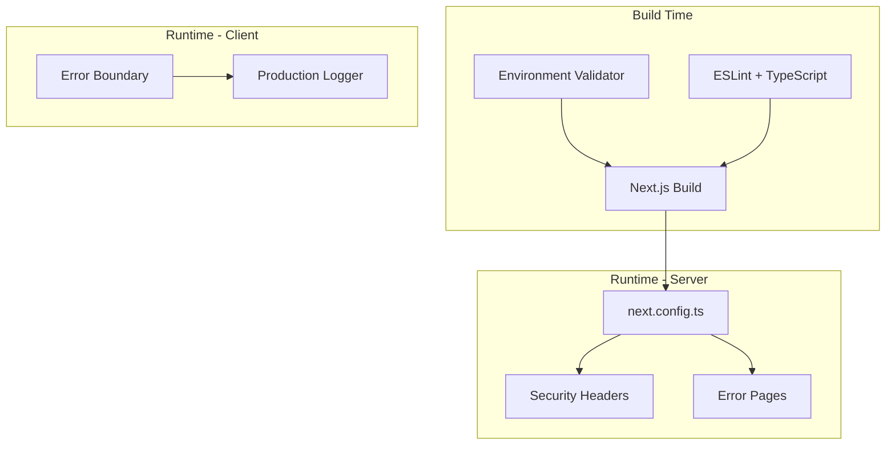

# Design Document: Production Readiness

## Overview

Dokumen ini menjelaskan desain teknis untuk mempersiapkan aplikasi Kivo Web (Next.js 16 + React 19) untuk deployment production. Fokus utama adalah konfigurasi environment yang aman, optimisasi performa, error handling yang robust, dan security best practices.

## Architecture



## Components and Interfaces

### 1. Environment Configuration

```typescript
// lib/env.ts
interface EnvConfig {
  // Server-only (tidak di-expose ke client)
  OPENAI_API_KEY: string;
  CLERK_SECRET_KEY: string;

  // Public (accessible di client)
  NEXT_PUBLIC_API_URL: string;
  NEXT_PUBLIC_CLERK_PUBLISHABLE_KEY: string;
  NEXT_PUBLIC_MAPBOX_ACCESS_TOKEN: string;
}

interface EnvValidationResult {
  isValid: boolean;
  missingVars: string[];
  errors: string[];
}
```

### 2. Security Headers Configuration

```typescript
// next.config.ts headers
interface SecurityHeaders {
  'X-Frame-Options': 'DENY' | 'SAMEORIGIN';
  'X-Content-Type-Options': 'nosniff';
  'Referrer-Policy': string;
  'Content-Security-Policy': string;
  'Strict-Transport-Security': string;
}
```

### 3. Error Boundary Component

```typescript
// components/error-boundary.tsx
interface ErrorBoundaryProps {
  children: React.ReactNode;
  fallback?: React.ReactNode;
}

interface ErrorBoundaryState {
  hasError: boolean;
  error: Error | null;
}
```

### 4. Production Logger

```typescript
// lib/logger.ts
interface Logger {
  info(message: string, meta?: Record<string, unknown>): void;
  warn(message: string, meta?: Record<string, unknown>): void;
  error(message: string, error?: Error, meta?: Record<string, unknown>): void;
}
```

## Data Models

### Environment Variables Schema

```typescript
const requiredServerEnvVars = ['OPENAI_API_KEY', 'CLERK_SECRET_KEY'] as const;

const requiredPublicEnvVars = [
  'NEXT_PUBLIC_API_URL',
  'NEXT_PUBLIC_CLERK_PUBLISHABLE_KEY',
  'NEXT_PUBLIC_MAPBOX_ACCESS_TOKEN',
] as const;
```

### Security Headers Schema

```typescript
const securityHeaders = [
  { key: 'X-Frame-Options', value: 'DENY' },
  { key: 'X-Content-Type-Options', value: 'nosniff' },
  { key: 'Referrer-Policy', value: 'strict-origin-when-cross-origin' },
  { key: 'X-XSS-Protection', value: '1; mode=block' },
  {
    key: 'Permissions-Policy',
    value: 'camera=(), microphone=(), geolocation=(self)',
  },
];
```

## Correctness Properties

_A property is a characteristic or behavior that should hold true across all valid executions of a system-essentially, a formal statement about what the system should do. Properties serve as the bridge between human-readable specifications and machine-verifiable correctness guarantees._

### Property Reflection

After analyzing the prework, the following properties are identified as non-redundant and provide unique validation value:

1. Environment validation properties (1.1, 1.2, 1.3) can be combined into a single comprehensive property about env validation
2. Security headers property (2.2) is unique
3. Error boundary property (3.1) is unique
4. Logging property (6.2) is unique

### Property 1: Environment Variable Validation Completeness

_For any_ set of required environment variables and any subset of defined variables, the validation function should return `isValid: false` with the exact list of missing variables when any required variable is undefined.

**Validates: Requirements 1.2, 1.3**

### Property 2: Security Headers Completeness

_For any_ HTTP response configuration, the headers array should contain all required security headers (X-Frame-Options, X-Content-Type-Options, Referrer-Policy, X-XSS-Protection).

**Validates: Requirements 2.2**

### Property 3: Error Boundary Recovery

_For any_ React component tree wrapped in ErrorBoundary, when a child component throws an error, the ErrorBoundary should catch it and render the fallback UI without propagating the error.

**Validates: Requirements 3.1**

### Property 4: Production Logger Suppression

_For any_ log call in production environment (NODE_ENV === 'production'), debug-level logs should be suppressed while error-level logs should still be recorded.

**Validates: Requirements 6.2**

## Error Handling

### Client-Side Error Handling

1. **Error Boundary**: Wrap main application components dengan ErrorBoundary untuk menangkap runtime errors
2. **Fallback UI**: Tampilkan pesan user-friendly tanpa technical details
3. **Error Reporting**: Log errors ke console (production) tanpa sensitive data

### Server-Side Error Handling

1. **Custom Error Pages**:
   - `app/error.tsx` - Generic error page
   - `app/not-found.tsx` - 404 page
   - `app/global-error.tsx` - Root error boundary

2. **API Error Responses**: Return structured error responses tanpa stack traces

## Testing Strategy

### Unit Testing (Vitest)

- Test environment validation function dengan berbagai kombinasi env vars
- Test security headers configuration structure
- Test logger behavior di different environments

### Property-Based Testing (fast-check)

Library: `fast-check` (sudah ada di devDependencies)

Minimum iterations: 100 per property

Format tag: `**Feature: production-readiness, Property {number}: {property_text}**`

**Property Tests to Implement:**

1. **Environment Validation Property Test**
   - Generate random subsets of required env vars
   - Verify validation correctly identifies all missing vars

2. **Security Headers Property Test**
   - Verify all required headers present in configuration
   - Verify no duplicate headers

3. **Error Boundary Property Test**
   - Generate components that throw various error types
   - Verify ErrorBoundary catches and renders fallback

4. **Logger Suppression Property Test**
   - Generate random log messages
   - Verify debug logs suppressed in production mode

### Integration Testing

- Build verification: `npm run build` succeeds
- Type checking: `tsc --noEmit` passes
- Lint: `npm run lint` passes

## SEO Configuration

### Metadata Structure

```typescript
// lib/seo.ts
interface SEOConfig {
  title: string;
  description: string;
  url: string;
  image?: string;
  type?: 'website' | 'article';
}

interface PageMetadata {
  title: string;
  description: string;
  openGraph: {
    title: string;
    description: string;
    url: string;
    siteName: string;
    images: Array<{ url: string; width: number; height: number; alt: string }>;
    type: string;
  };
  twitter: {
    card: 'summary' | 'summary_large_image';
    title: string;
    description: string;
    images: string[];
  };
}
```

### SEO Files

1. **robots.txt** - `public/robots.txt`
   - Allow all crawlers for public pages
   - Disallow admin/private routes

2. **sitemap.xml** - Generated via `app/sitemap.ts`
   - List all public pages
   - Include lastModified dates

3. **Page Metadata** - Each page exports metadata using Next.js Metadata API
